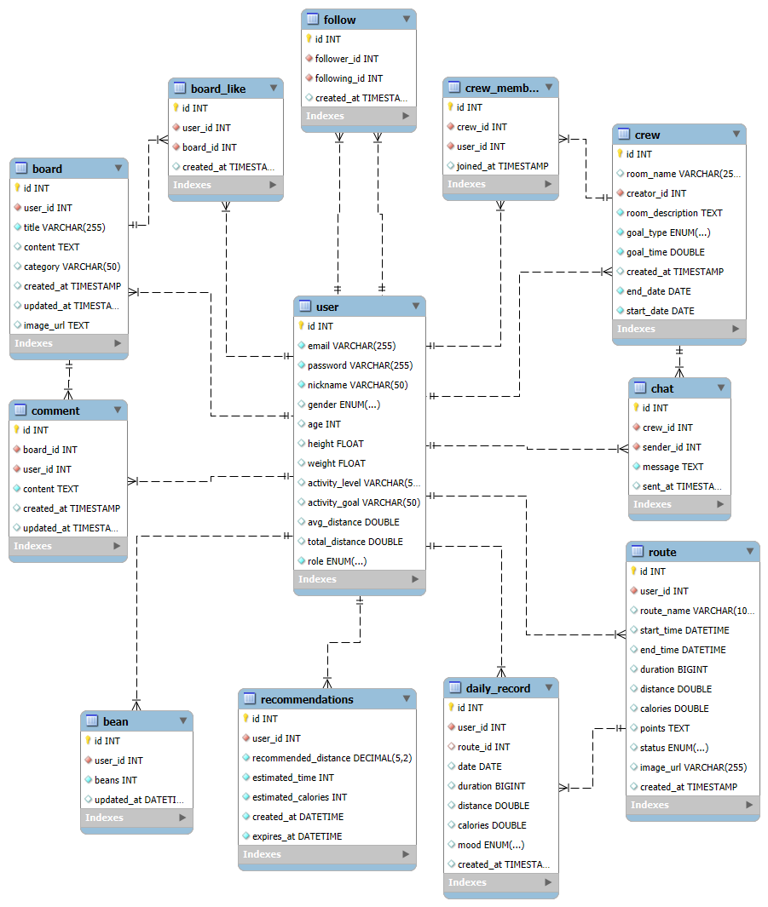

## 🏃‍♀️ 커뮤니티 기반 러닝 플랫폼, 뛰콩


### 프로젝트 소개

* **뛰콩**은 러닝을 좋아하거나 이제 시작하려는 사람들이 함께 목표를 달성하고, 활동을 기록·공유하며, **AI 추천과 소셜 기능을 통해 꾸준한 러닝 습관을 만들어가는 커뮤니티 기반 러닝 플랫폼**입니다.
* 사용자는 **크루를 생성하거나 참여**하여 함께 목표를 설정하고, **채팅**을 통해 서로를 응원하며 달릴 수 있습니다.
* 다양한 유저를 팔로우하고, **게시글을 작성하거나 좋아요·댓글로 소통**하며 러닝 경험을 나눌 수 있습니다.
* **AI 기반 러닝 목표 추천 기능**은 사용자의 활동 데이터를 분석해 체력과 운동 습관에 맞는 **맞춤형 거리·시간 목표**를 제시합니다.
* 나의 **전체 러닝 데이터를 통계 및 시각화**로 확인할 수 있어, **지속적인 동기부여**를 제공합니다.

### ⏳ 개발 기간

2025.04.24 ~ 2025.05.28

### 🛠 기술 스택

* **Frontend**: Vue.js, Vite, HTML5, CSS3
* **Backend**: Spring Boot, Spring Security (JWT), Spring Scheduler, JPA (Hibernate), MyBatis, Maven
* **Database**: MySQL
* **AI 추천 기능**: Python, Flask
* **Deployment**: Kakao Map API, Tmap API, html2canvas, ngrok
* **Version Control**: Git, GitHub
* **Collaboration & Design**: Figma, Notion: [기획 문서 바로가기](https://www.notion.so/1dffead1fed780d282dcd55fa5046f0f?pvs=4)

---

## 📌 주요 기능

### 🔑 회원 관리

* 회원가입 및 로그인
* JWT 기반 인증 처리
* 사용자 프로필 등록 및 수정
* 유저 간 팔로우 / 언팔로우
* 활동 레벨업 시스템

### 🏃‍♀️ 러닝 기록 관리

* Kakao Map 기반 실시간 러닝 경로, 시간, 거리 추적
* 러닝 종료 시 기록 저장 및 지도 이미지 캡처
* 전체/월/일 단위 러닝 이력 조회

### 💬 커뮤니티 및 게시판

* 러닝 팁, 후기, 질문 공유 게시판
* 게시글 검색 기능
* 댓글 및 좋아요로 상호작용

### 📡 그룹 챌린지 (크루)

* 크루 검색 및 가입/탈퇴
* 실시간 크루 전용 채팅
* 크루별 목표 달성률 및 러닝 기록 열람

## 🌟 추가 기능

### 🗺️ 러닝 루트 기능

* 출발지/도착지 선택으로 루트 탐색
* Tmap API 기반 도보 경로 시각화

### 🤖 AI 맞춤 러닝 추천

* 사용자 활동 데이터를 기반으로 맞춤형 러닝 목표 추천
  (거리, 시간, 칼로리 소모량)

---

## 🧩 서비스 설계

### 📐 와이어프레임

* [Figma 프로토타입 보기](https://www.figma.com/proto/jh9kHsRlVjcg47PD4Qx74S/%EB%9B%B0%EC%BD%A9?node-id=2104-4&t=0kcP3nLkVWImOs8q-1&starting-point-node-id=2104%3A4)


### 🗂 데이터베이스 모델링 (ERD)

* 사용자(User), 러닝기록(Route), 크루(Crew), 러닝통계(Daily_Record), 채팅(Chat), 콩(Bean), 게시판(Board) 테이블로 구성



### 🔗 URL 명세서 (REST API)

* Swagger 기반 문서화
* ttuikong_API.pdf 첨부

### 🧱 Vue 컴포넌트 구조

```
src/
├── components/
│   ├── PasswordConfirmModal.vue
│   ├── PostCard.vue
│   └── TermsModal.vue
├── views/
│   ├── Calendar.vue
│   ├── Chat.vue
│   ├── Home.vue
│   ├── RunTimer.vue
│   ├── Board.vue
│   ├── Login.vue
│   ├── PostDetail.vue
│   ├── PostWrite.vue
│   ├── Profile.vue
│   ├── ProfileEdit.vue
│   ├── RouteFind.vue
│   ├── RunHome.vue
│   ├── RunWithCrew.vue
│   ├── RunWithRank.vue
│   ├── SignUp.vue
│   ├── SignUp2.vue
│   └── SignUp3.vue
└── App.vue
```

### 👨‍👩‍👧‍👦 팀원 소개 (2명)

* 팀장 : 김유미 
* 팀원 : 이은 

## 업무 분담

* 김유미 (FE & BE) : 

**📄 UI**

**페이지**: 로그인/회원가입, 크루 목록, 크루 채팅방, 실시간 러닝 타이머, 러닝 랭킹
**공통 컴포넌트**: 러닝 기록 캘린더, 레벨업

**⚙️ 기능**

* JWT 기반 로그인/로그아웃
* 러닝 거리/시간/경로 실시간 추적 및 결과 이미지/데이터 저장
* 하루 러닝 시간 누적 및 크루별 통계 조회
* 크루 생성/참여/탈퇴, 챌린지 진행률 표시, 채팅 기능 구현
* 활동에 따른 콩 지급 및 레벨업 처리

* 이은 (FE & BE) : 

**📄 UI**

**페이지**: 게시판 목록, 게시글 상세/작성/수정, 지도 기반 경로 조회, 마이페이지 
**공통 컴포넌트**: 게시글 카드, 댓글 입력창, 팔로우/팔로잉 리스트, AI 기반 목표 추천, 경로 조회 시 AI 기반 목표 수정 

**⚙️ 기능**

* 회원 정보 조회/수정 기능 
* 게시글 등록, 수정, 삭제, 댓글/좋아요 기능
* 팔로우 기능: 목록 조회 및 팔로우/언팔로우
* 게시글 검색 및 좋아요한 게시글 목록 조회
* 인기/팔로잉 게시글 조회 
* 지도 기반 경로 찾기 (TMap API 활용)
* AI 기반 맞춤형 러닝 목표 추천

---
## 후기

* 김유미 

* 이은


---

> 뛰콩과 함께 새로운 도전을 시작하세요! 🐾
