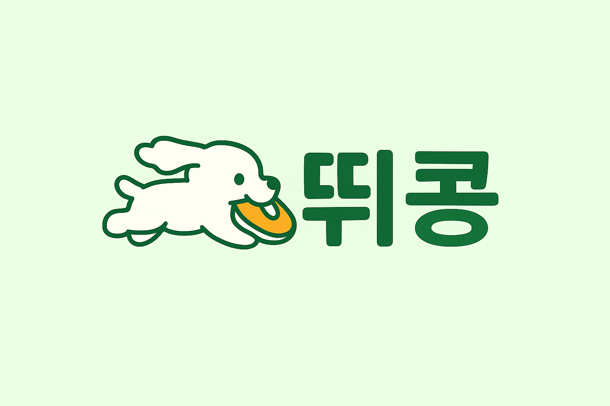

# 🏃‍♂️ SSAFIT_KIMYUMI_LEEEUN

## 🎉 **뛰콩 - 커뮤니티 기반 운동 플랫폼**
> **혼자 뛰지 말고, 같이 뛰콩!**  
>
> 사용자들의 운동 습관을 돕는 **커뮤니티 기반 운동 플랫폼**입니다.  
> 자신의 운동 루트를 기록하고 공유하며, 같은 목표를 가진 사람들과 그룹을 이루어 운동하고, 커뮤니티를 통해 소통할 수 있습니다.

---

## 🏗️ **주요 기능**

✅ **회원 관리**  
- 회원가입 / 로그인 / 로그아웃  
- 프로필 수정 (키, 몸무게, 운동 목표 등)

✅ **운동 기록 관리**  
- 운동 캘린더  
- 루트(코스) 기록 및 확인  

✅ **게시판 관리**  
- 글 작성 / 수정 / 삭제  
- 댓글 기능  
- 게시글 좋아요

✅ **실시간 그룹 채팅**  
- WebSocket 기반 실시간 채팅  

✅ **운동 루트 기능**  
- 출발/도착지 입력 → 거리 계산  

✅ **AI 기반 운동 목표 추천**  
- 개인 정보(키, 몸무게, 운동량, 식습관) 기반 맞춤형 추천  

---

## 📐 **프로토타입 확인하기**

👉 [프로토타입 보러가기 (Figma 링크)](https://www.figma.com/proto/jh9kHsRlVjcg47PD4Qx74S/%EB%9B%B0%EC%BD%A9?node-id=2104-4&t=0kcP3nLkVWImOs8q-1&starting-point-node-id=2104%3A4)

---

## ✍️ **팀 소개**

- **김유미**
- **이은**

